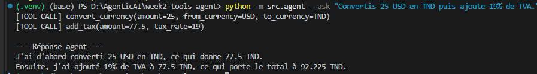

# Week 2 — Agent avec Tools / Function Calling

Ce projet correspond à la **semaine 2** de ma roadmap Agentic AI.

Après avoir réalisé en Week 1 un assistant de résumé avec sortie JSON structurée, l’objectif de cette deuxième semaine était de créer un agent capable **d’utiliser des outils Python** pour exécuter des actions concrètes.

L’agent peut comprendre une demande en langage naturel, choisir les bons outils, exécuter les fonctions nécessaires, puis retourner une réponse finale claire.

---

## Objectif du projet

Créer un agent IA capable de traiter une demande comme :

```text
Convertis 25 USD en TND puis ajoute 19% de TVA.
```

L’agent doit automatiquement :

1. comprendre qu’une conversion de devise est nécessaire ;
2. appeler l’outil `convert_currency` ;
3. récupérer le résultat ;
4. appeler l’outil `add_tax` ;
5. retourner le montant final avec une explication claire.

---

## Ce que j’ai appris

Dans ce projet, j’ai appris à :

* créer des outils Python simples ;
* connecter ces outils à un modèle Gemini ;
* utiliser le principe du **Function Calling / Tool Calling** ;
* laisser l’agent choisir automatiquement quel outil appeler ;
* limiter le nombre d’appels outils pour éviter les boucles ;
* afficher les appels outils dans le terminal pour comprendre le raisonnement de l’agent ;
* tester les outils avec `pytest` sans consommer l’API Gemini ;
* sécuriser une calculatrice en évitant l’utilisation dangereuse de `eval()`.

---

## Technologies utilisées

* Python
* Gemini API
* Google Gen AI SDK
* python-dotenv
* pytest
* PowerShell
* VS Code

---

## Structure du projet

```text
week2-tools-agent/
│
├── .venv/
├── src/
│   ├── __init__.py
│   ├── agent.py
│   ├── prompts.py
│   └── tools.py
│
├── tests/
│   ├── __init__.py
│   └── test_tools.py
│
├── docs/
│   └── images/
│       ├── resultat-week2.png
│       └── tests-week2.png
│
├── .env
├── .gitignore
├── README.md
└── requirements.txt
```

---

## Rôle des fichiers principaux

### `src/tools.py`

Ce fichier contient les outils que l’agent peut utiliser.

Outils créés :

```python
calculator(expression: str) -> float
convert_currency(amount: float, from_currency: str, to_currency: str) -> float
add_tax(amount: float, tax_rate: float) -> float
```

Ces fonctions permettent à l’agent de faire des calculs, convertir des devises et ajouter une taxe.

---

### `src/prompts.py`

Ce fichier contient le prompt système de l’agent.

Le prompt explique à l’agent :

* son rôle ;
* les outils disponibles ;
* quand utiliser les outils ;
* comment répondre à l’utilisateur.

---

### `src/agent.py`

Ce fichier lance l’agent Gemini.

Il charge la clé API depuis `.env`, connecte les outils Python au modèle Gemini, reçoit la demande utilisateur, puis retourne la réponse finale.

---

### `tests/test_tools.py`

Ce fichier contient les tests unitaires des outils.

Les tests vérifient :

* les calculs simples ;
* les conversions de devises ;
* l’ajout de TVA ;
* les erreurs de devise non supportée ;
* la sécurité de la calculatrice.

---

## Exemple d’exécution

Commande utilisée :

```bash
python -m src.agent --ask "Convertis 25 USD en TND puis ajoute 19% de TVA."
```

Résultat obtenu :



Dans cet exemple, l’agent a bien appelé deux outils :

```text
[TOOL CALL] convert_currency(amount=25, from_currency=USD, to_currency=TND)
[TOOL CALL] add_tax(amount=77.5, tax_rate=19)
```

Le résultat final est :

```text
25 USD = 77.5 TND
77.5 TND + 19% TVA = 92.225 TND
```

Cela montre que l’agent n’a pas seulement répondu avec du texte : il a utilisé des fonctions Python pour calculer le résultat.

---

## Tests unitaires

Commande utilisée :

```bash
python -m pytest
```

Résultat obtenu :


Tous les tests passent avec succès :

```text
9 passed
```

Cela confirme que les outils fonctionnent correctement sans appeler l’API Gemini.

---

## Concepts importants compris

### 1. Tool Calling

Le **Tool Calling** permet à un modèle IA d’utiliser des fonctions externes au lieu de seulement générer du texte.

Exemple :

```text
Utilisateur : Convertis 25 USD en TND.
Agent : Je dois appeler convert_currency().
```

Le modèle comprend l’objectif, choisit l’outil adapté, prépare les arguments, puis utilise le résultat de l’outil pour produire une réponse finale.

---

### 2. Différence entre chatbot et agent

Un chatbot simple répond avec du texte.

Un agent peut :

* comprendre une demande ;
* choisir un outil ;
* exécuter une fonction ;
* utiliser le résultat ;
* produire une réponse finale.

Dans ce projet, Gemini joue le rôle de décideur, tandis que les fonctions Python jouent le rôle d’outils exécutables.

---

### 3. Sécurité des outils

Pour la calculatrice, je n’ai pas utilisé `eval()` car c’est dangereux.

À la place, j’ai utilisé une logique plus sécurisée avec `ast`, en autorisant seulement les opérations mathématiques simples.

Cela permet d’éviter qu’une expression malveillante soit exécutée comme du code Python.

---

### 4. Tests sans API

Les tests unitaires ne doivent pas appeler Gemini.

Ils testent uniquement les fonctions Python :

```python
calculator()
convert_currency()
add_tax()
```

Cela permet de tester rapidement le projet sans consommer de quota API.

---

## Commandes utiles

Créer l’environnement virtuel :

```bash
python -m venv .venv
```

Activer l’environnement virtuel :

```bash
.\.venv\Scripts\Activate.ps1
```

Installer les dépendances :

```bash
pip install google-genai python-dotenv pytest
```

Sauvegarder les dépendances :

```bash
pip freeze > requirements.txt
```

Lancer l’agent :

```bash
python -m src.agent --ask "Convertis 25 USD en TND puis ajoute 19% de TVA."
```

Lancer les tests :

```bash
python -m pytest
```

---

## Configuration `.env`

Le fichier `.env` doit contenir :

```env
GEMINI_API_KEY=your_gemini_api_key_here
GEMINI_MODEL=gemini-2.5-flash
```

Le fichier `.env` ne doit jamais être envoyé sur GitHub.

Il doit être ignoré dans `.gitignore`.


---


Comme elles sont stockées dans le repo, elles resteront visibles dans GitHub même si les images originales sont supprimées du PC.


---

## Résultat final de la Week 2

À la fin de cette semaine, j’ai construit un premier vrai agent IA capable d’utiliser des outils.

Le flow complet est :

```text
Demande utilisateur
        ↓
Gemini comprend l’objectif
        ↓
Gemini choisit un outil
        ↓
Python exécute la fonction
        ↓
Gemini reçoit le résultat
        ↓
Gemini produit la réponse finale
```

---

## Compétence acquise

Cette Week 2 m’a permis de comprendre la base des agents IA modernes :

```text
LLM + Tools + Function Calling + Tests = Agent capable d’agir
```

Ce projet prépare directement les prochaines étapes de la roadmap :

* Week 3 : RAG avec documents ;
* Week 4 : mémoire ;
* Week 5 : agent connecté à une vraie API ;
* projet final : agent IA pour HotelOps.
